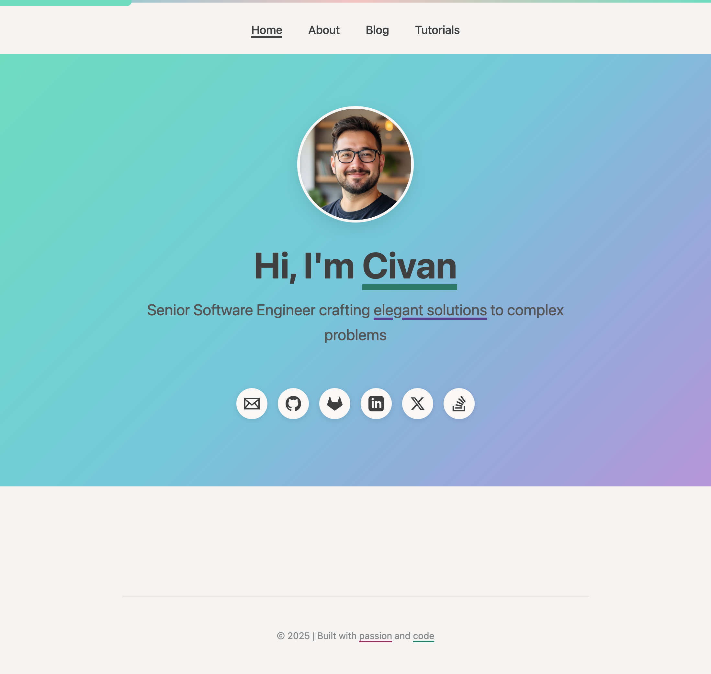

# Xlith Theme

A modern theme for [Joplin Pages Publisher](https://github.com/ylc395/pages-publisher) featuring advanced tag-based organization, hierarchical navigation, and intelligent content filtering.

An implementation of this theme can be found in [civan.me](https://civan.me)



## Prerequisites

- [Joplin](https://joplinapp.org/) with [Pages Publisher](https://github.com/ylc395/pages-publisher) plugin installed
- Understanding of Pages Publisher basics ([read the documentation](https://github.com/ylc395/pages-publisher))

## Installation

1. **Get the themes directory** from Pages Publisher settings panel (click "How to create custom theme?")
2. **Clone this theme**:
   ```bash
   cd [themes-directory]
   git clone https://github.com/xlith/joplin-plugin-pages-publisher-theme.git xlith_theme
   ```
3. **Select the theme** in Pages Publisher settings

## Theme Features

### 1. Smart Tag System

This theme uses a three-tier tagging system for powerful content organization:

#### Page Type Tags (`att-page:`)
Defines what type of page/content the note becomes:
- `att-page:blog` - Blog post (appears on Blog page)
- `att-page:tutorial` - Tutorial (appears on Tutorials page)
- `att-page:about` - About page content

**Usage**: Add one page type tag to each note you want to publish.

#### Sidebar Category Tags (`att-sb:`)
Creates hierarchical navigation in the Tutorials sidebar:
- Format: `att-sb:Category:Subcategory:Topic`
- Examples:
  - `att-sb:Frontend:JavaScript`
  - `att-sb:Frontend:React:Hooks`
  - `att-sb:Backend:Node.js`
  - `att-sb:DevOps:Docker:Containers`

**How it works**:
- Automatically builds a nested tree structure in the sidebar
- Shows article count for each category
- Click any category to filter tutorials
- Expand/collapse categories with arrow icons

**Usage**: Add one or more `att-sb:` tags to tutorial notes to organize them hierarchically.

#### Display Tags
Regular Joplin tags for filtering and display:
- Examples: `javascript`, `react`, `beginner`, `advanced`, `api`, `database`
- Shown as colored badges on article cards
- Used for blog post filtering
- Not shown in sidebar navigation

**Usage**: Add regular tags to describe your content's topics and difficulty.

### 2. Hierarchical Sidebar Navigation (Tutorials Page)

The Tutorials page features an intelligent sidebar that:
- **Auto-generates** nested categories from `att-sb:` tags
- **Shows counts** - displays number of tutorials in each category
- **Smart filtering** - click any level to filter:
  - Click `Frontend` → shows all Frontend tutorials
  - Click `Frontend > React` → shows only React tutorials
  - Click `Frontend > React > Hooks` → shows only Hooks tutorials
- **Expandable** - collapse/expand categories with arrow icon
- **Mobile-friendly** - floating button on mobile devices

### 3. Blog Post Filtering (Blog Page)

The Blog page includes tag-based filtering:
- **Tag buttons** - automatically generated from your display tags
- **"All" button** - shows all blog posts
- **Active state** - highlights currently selected filter
- **Count badges** - shows number of posts per tag
- **Smooth animations** - fade in/out transitions
- **No results message** - appears when no posts match filter

### 4. Hero Images

Automatically extracts hero images from your markdown:
- Add an image with `"hero"` as the title attribute:
  ```markdown
  
  ```
- The theme will:
  - Display it at the top of the article
  - Show it as thumbnail on listing pages
  - Use it in meta tags for social sharing

### 5. About Page

Create your About page by tagging a note with `att-page:about`:
- Write your bio/information in a Joplin note
- Add the tag `att-page:about`
- Publish via Pages Publisher
- Content appears automatically on the About page

**Important**: Only one note should have the `att-page:about` tag.

### 6. Responsive Design

- Mobile-first design
- Touch-friendly controls (44px minimum tap targets)
- Collapsible sidebar on mobile
- Optimized typography for all screen sizes
- Works on phones, tablets, and desktops

### 7. Reading Time

Automatically calculates and displays estimated reading time for each article based on word count (~200 words/minute).

## Quick Start Examples

### Example 1: Create a Blog Post
```
Note title: Getting Started with JavaScript
Tags: att-page:blog, javascript, beginner, tutorial
```

### Example 2: Create a Tutorial with Hierarchy
```
Note title: React Hooks Complete Guide
Tags: att-page:tutorial, att-sb:Frontend:React:Hooks, react, javascript, intermediate
```
- Appears on Tutorials page
- Categorized under Frontend → React → Hooks in sidebar
- Shows tags: react, javascript, intermediate

### Example 3: Create Nested Categories
```
Tutorial 1: att-sb:Frontend:React
Tutorial 2: att-sb:Frontend:React:Hooks
Tutorial 3: att-sb:Frontend:React:Components
Tutorial 4: att-sb:Frontend:Vue
```
Results in sidebar structure:
```
Frontend (4)
  └── React (3)
      ├── Hooks (1)
      └── Components (1)
  └── Vue (1)
```

### Example 4: About Page
```
Note title: About Me
Tags: att-page:about
Content: Your bio and information
```

## Configuration

### Site Settings
Configure through Pages Publisher settings:
- **Site Name** - Your site's name
- **Site Description** - Meta description for SEO
- **Site URL** - Full URL (e.g., `https://example.com`)

### Home Page
- **Profile Image** - Path to profile image
- **Greeting** - Welcome text (supports HTML)
- **Menu** - Navigation links
- **Social Links** - Up to 12+ platforms supported

### Theme Colors

Edit `_assets/css/style.css` to customize colors:

```css
:root {
  --color-mint: #6fdcbf;     /* Primary accent */
  --color-sea: #72cada;      /* Secondary accent */
  --color-lilac: #ae8fdb;    /* Tertiary accent */
  --color-peach: #f2c3c0;    /* Quaternary accent */
}
```

### Underline Styles

Use in your content for styled underlines:
- `<span class="underline-mint">text</span>`
- `<span class="underline-sea">text</span>`
- `<span class="underline-lilac">text</span>`
- `<span class="underline-peach">text</span>`

## File Structure

```
/
├── image.png
├── README.md
├── Screenshot-1.png
├── Screenshot-2.png
└── xlith_theme/
    ├── config.json
    ├── _assets/
    │   ├── css/
    │   │   ├── accessibility-fixes.css
    │   │   └── style.css
    │   ├── images/
    │   │   └── profile.jpg
    │   └── js/
    │       ├── script.js
    │       └── modules/
    │           ├── animations.js
    │           ├── blog-filter.js
    │           ├── links.js
    │           ├── sidebar.js
    │           └── tags.js
    └── templates/
        ├── about.ejs
        ├── archive.ejs
        ├── article.ejs
        ├── index.ejs
        ├── tutorials.ejs
        ├── helpers/
        │   ├── dateHelpers.ejs
        │   └── tagHelpers.ejs
        └── partials/
            ├── article-card.ejs
            ├── footer.ejs
            └── header.ejs
```

## Troubleshooting

### Tutorials not appearing in sidebar
- Check that notes have `att-page:tutorial` tag
- Verify `att-sb:` tags are properly formatted (use `:` as separator)
- Ensure Pages Publisher has published the notes

### Blog posts not filtering
- Regular tags (not `att-page:` or `att-sb:`) are used for blog filtering
- Check that posts have `att-page:blog` tag
- Verify display tags are added to the notes

### About page empty
- Ensure exactly one note has `att-page:about` tag
- Check that the note has been published via Pages Publisher

## Credits

- Built for [Joplin Pages Publisher](https://github.com/ylc395/pages-publisher)
- Designed by xlith using lots of ai power

---

**Need help?** Check the [Pages Publisher documentation](https://github.com/ylc395/pages-publisher) or open an issue on GitHub.

## Support This Theme

If you find this theme useful, please consider leaving a star on its GitHub repository! 

⭐ [Star on GitHub](https://github.com/xlith/joplin-plugin-pages-publisher-theme) ⭐
